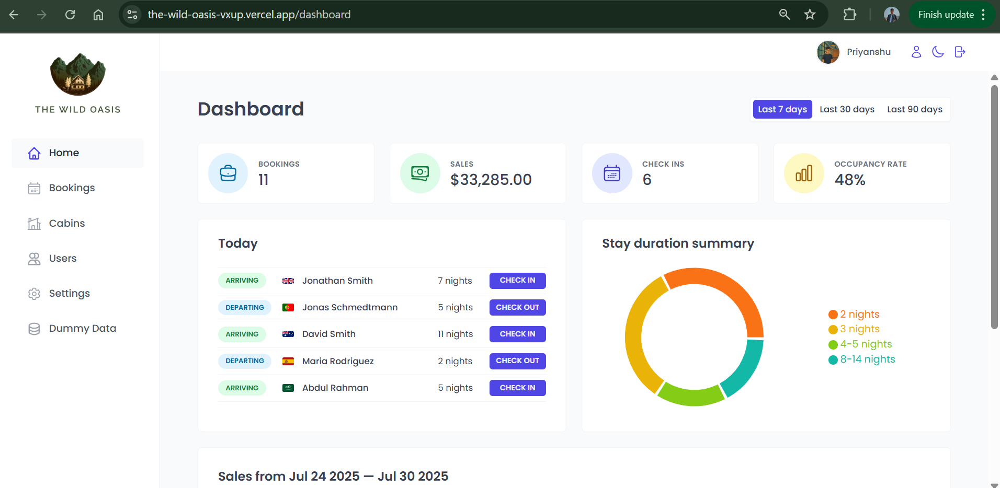
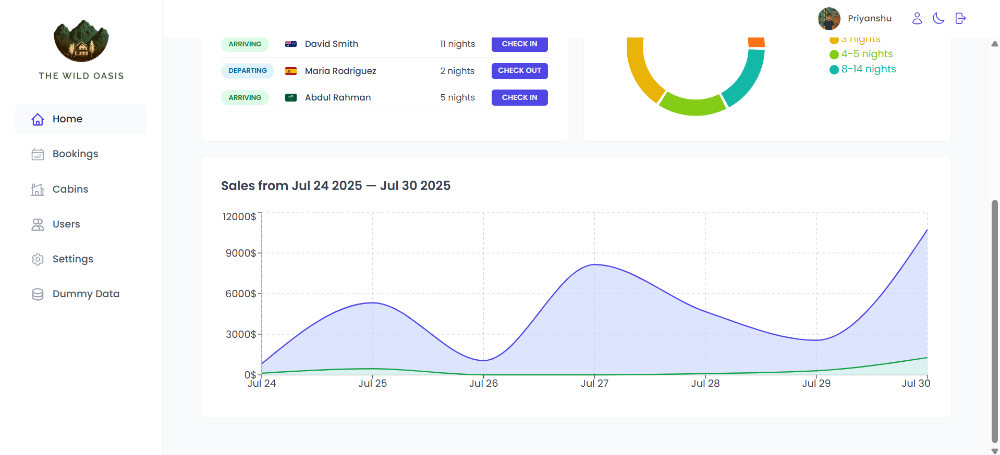
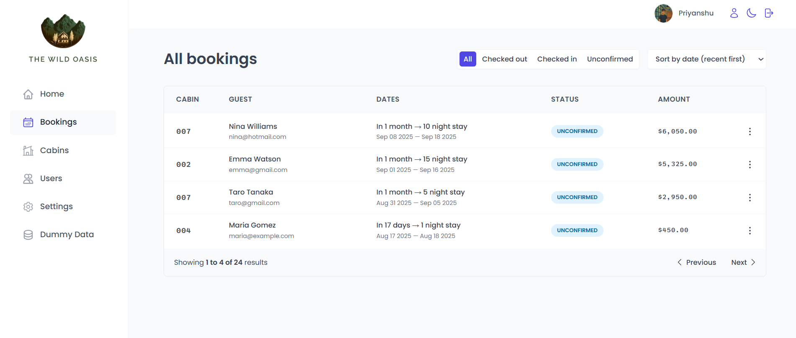
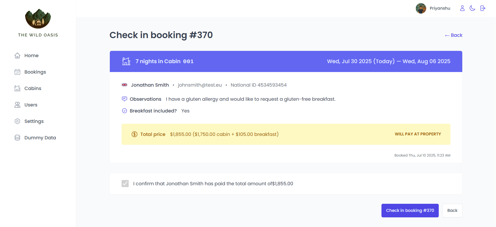
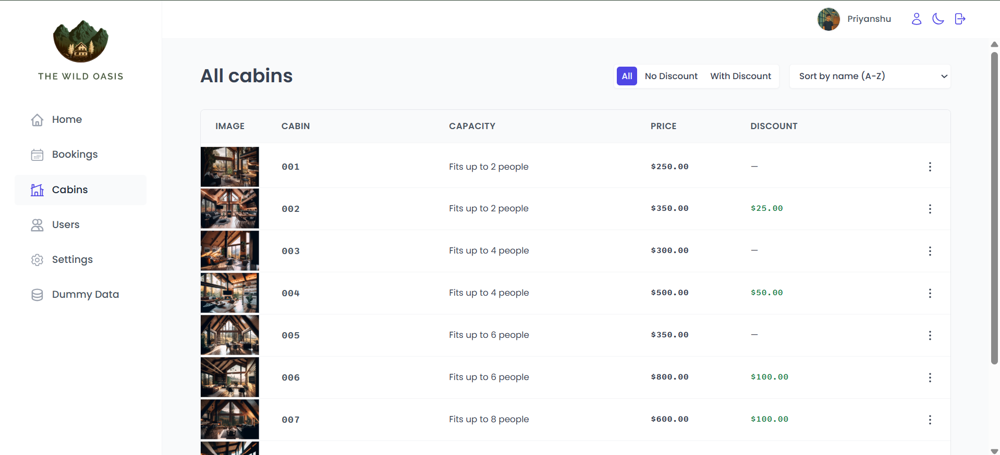
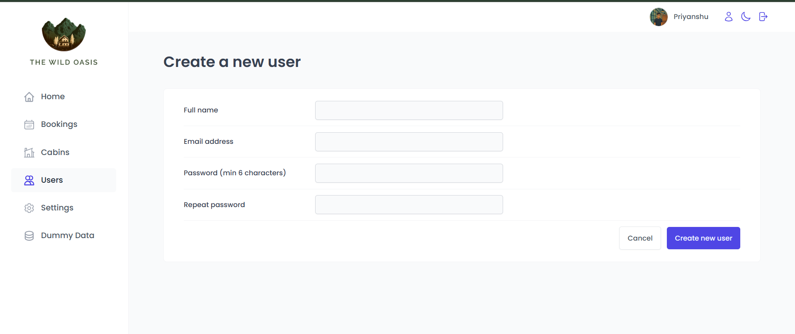
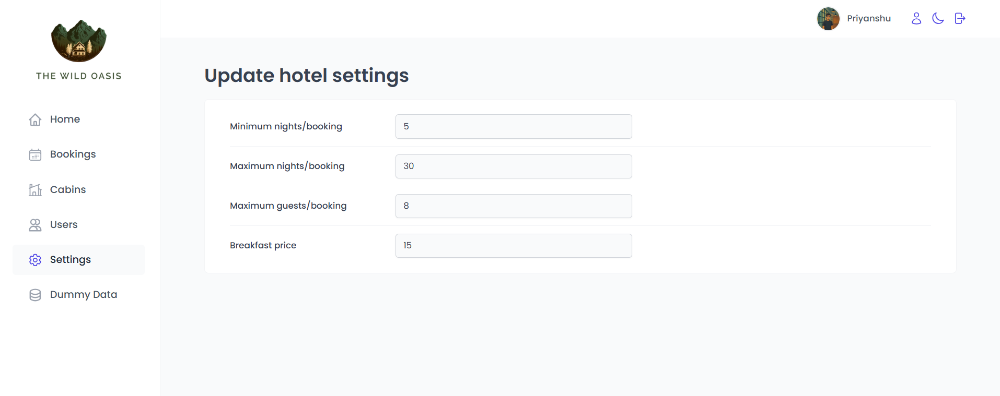
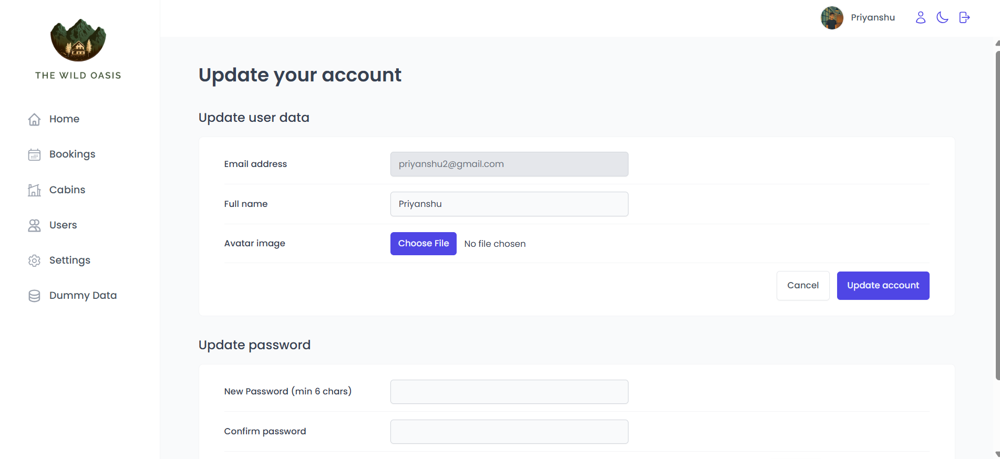
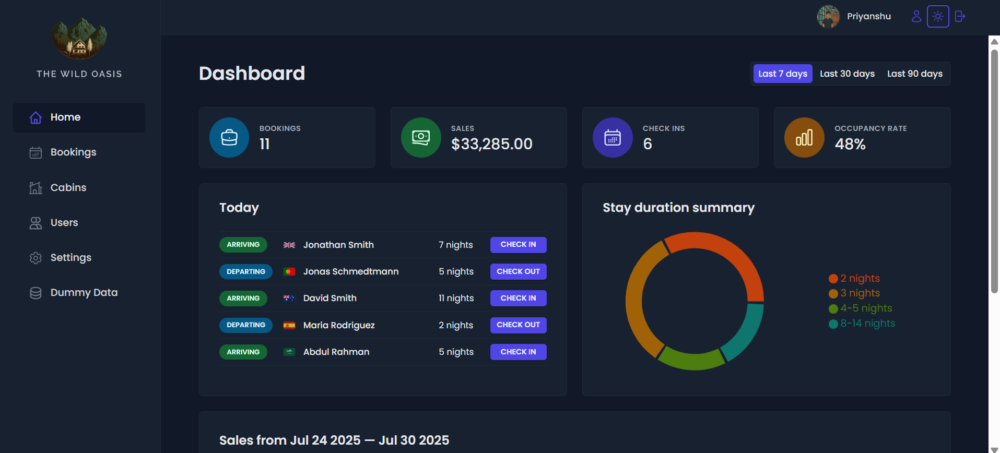

# 🛎️ Villa Booking Admin Dashboard

A powerful admin dashboard to help hotel/villa staff manage all aspects of reservations and property operations. Built as a companion to the [Villa Booking Website](https://github.com/PriyanshuPundhir/the-wild-oasis-website), this tool streamlines booking workflows, cabin management, and customer check-ins.

## 🚀 Try It Out

🌐 **Live Demo:** [Click here to explore the dashboard](https://the-wild-oasis-vxup.vercel.app/login)

> 🔐 Custom login required to access the dashboard.
<p>
  <strong>Use these credessentials :-</strong>
  <br>User name - priyanshu2@gmail.com
  <br>password - 654321
</p>

## 📸 Screenshots

<p>
  <br>
  <strong>Booking dashboard with metrics and charts 1</strong>
</p>
<br>

<p>
  <br>
  <strong>Booking dashboard with metrics and charts 2</strong>
</p>
<br>

<p>
  <br>
  <strong>Filtered and sorted bookings table</strong>
</p>
<br>

<p>
  <br>
  <strong>Check-in and check-out management</strong>
</p>
<br>

<p>
  <br>
  <strong>Cabins Table</strong>
</p>
<br>

<p>
  <br>
  <strong>Modify cabin details</strong>
</p>
<br>
<p>
  <br>
  <strong>Create a new staff user</strong>
</p>
<p>
  <br>
  <strong>Update general settings related to hotel</strong>
</p>
<p>
  <br>
  <strong>Update your password</strong>
</p>
<p>
  <br>
  <strong>Dark mode UI</strong>
</p>

## ✨ Features

- 📅 Manage **past**, **current**, and **upcoming** bookings
- 🛏️ Add, edit, or delete cabins
- ✅ Check-in and check-out customers
- 📊 Charts for revenue, occupancy, and KPIs
- 🌙 Toggle **Dark Mode**
- ⚡ **Prefetching**, **client/server-side filtering**, and **optimizations**
- 🔐 Secure custom authentication

## 🛠️ Tech Stack

- **Framework**: React (Vite)
- **State/Data**: React Query, Redux Toolkit
- **Styling**: Tailwind CSS
- **Auth**: Custom Auth Implementation
- **Deployment**: Vercel

## 📦 Installation

```bash
git clone https://github.com/your-username/villa-admin-dashboard.git
cd villa-admin-dashboard
npm install
npm run dev
